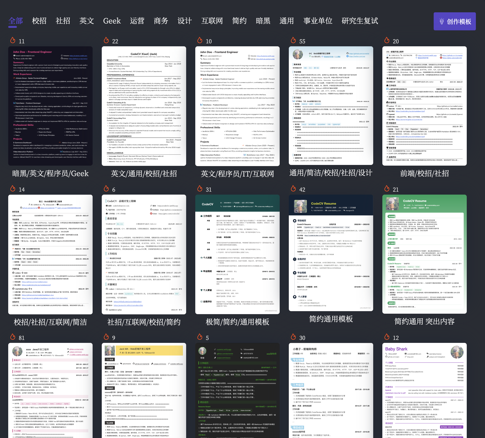
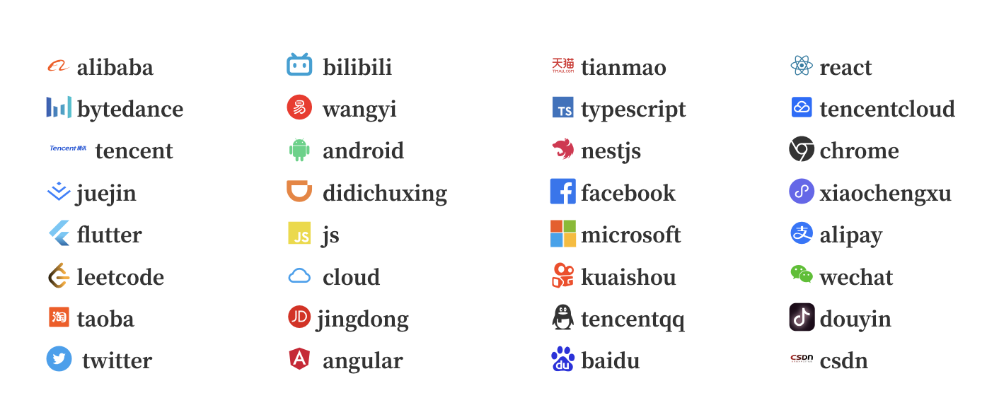

# codecv

This is a tool for creating resumes using `markdown`. It can convert your written `markdown` resume into a `PDF` format, supports multiple templates, and runs on love.

<div style="font-size: 1.5rem;">
  <a href="./README.md">中文</a> |
  <a href="./README.en.md">English</a>
</div>
</br>

[Online 1](https://codecv.top) [Online 2](https://codeleilei.gitee.io/markdown2pdf)

> Declaration: This project is published on GitHub/Gitee, free and as an open source learning use, use spare time for continuous development, deployment please indicate the original author and the original warehouse address in a prominent place on the website, do not use for commercial purposes without the author's permission!

## 😄 Docker deploy

You can directly run using the image I have already built.

```sh
docker run -d -t -p 8080:80 --name codecv --restart=always docker.io/wenyang0/codecv:latest
```

Or, you can manually compile it yourself if you prefer.

```sh
#clone the code
git clone https://github.com/acmenlei/codecv.git

#docker build
cd codecv/
docker build -t codecv:v1 .

#start server
docker run -d -t -p 8080:80 --name codecv --restart=always codecv:v1
```

Finally, open your browser and access the service's address at http://serverIP:8080

## 🤩 Preview of the result

<p>Resume template</p>



<p>Resume editing and dark themes</p>


<p>Built-in multiple vector ICONS</p>



## ✊🏻 Features to be implemented

[✓] Mobile device adaptation

[✓] Improved content mode experience

[✓] Template design (continuously updating... contributions to the repository templates are welcome)

## 🤔 Common issues

[Please refer to the user guide for grammar-related questions.](https://codeleilei.gitee.io/markdown2pdf/#/syntax/helper)

**Q**: Why export `PDF` after garbled code?

**A**: It may be that the old font is cached, please click the reset resume content in the toolbar at the top of the preview to reset, of course, please ensure that you have saved the content before resetting.

**Q**: Why does the export fail?

**A**: At present, the service is deployed on the `Netlify Serverless` service, because it is a foreign server, access is easy to error, please try several times, of course, you can also use the local export `PDF` replacement.

## 🙏 Sponsor

If you think this project is helpful to you and circumstances permit, you can give me a little support. In short, thank you very much for your support ~

<div style="display: flex; gap: 20px;">
	<div style="text-align: center">
		<p>WeChat</p>
		
	</div>
	<div style="text-align: center">
		<p>Alipay</p>
		
	</div>
</div>

## License

MIT © [Coderlei](./license)
