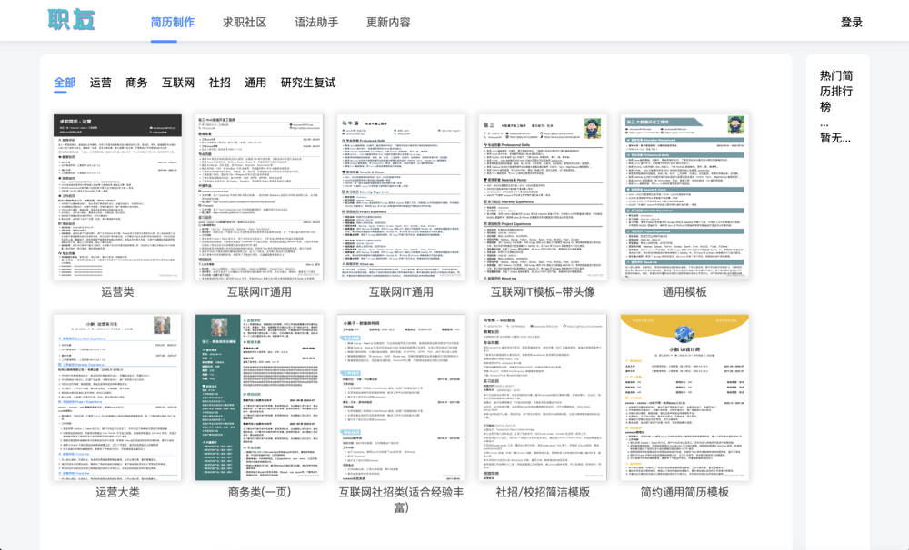
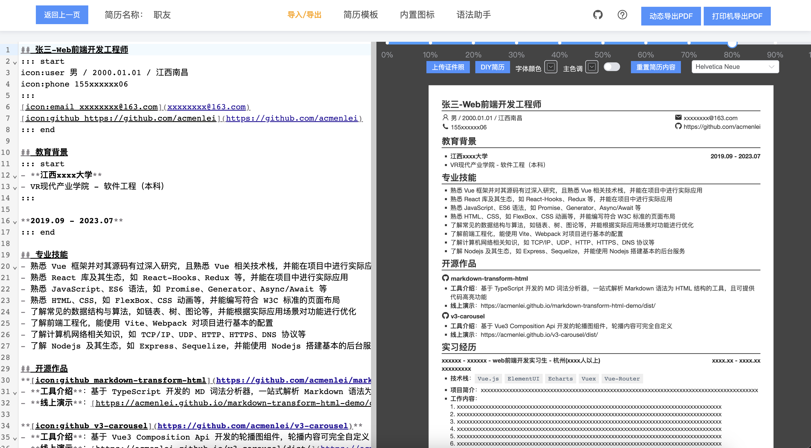

# markdown-resume-to-pdf

<div style="font-size: 1.5rem;">
  <a href="./README.md">中文</a> |
  <a href="./README.en.md">English</a>
</div>
</br>

[在线编辑地址 1](http://codeleilei.gitee.io/markdown2pdf/) [在线编辑地址 2](https://acmenlei.github.io/markdown-resume-to-pdf/dist/)

> 声明：此项目发布于 Github/Gitee，基于 MIT 协议，免费且作为开源学习使用。并且不会有任何形式的卖号、付费服务、讨论群、讨论组等行为。谨防受骗。
<p>简历模板<p>

<p>简历编辑页<p>


- [介绍](#介绍)

- [待实现功能](#待实现功能)

- [前置要求](#前置要求)

 - [Node](#node)

 - [PNPM](#pnpm)

- [安装依赖](#安装依赖)

- [测试环境运行](#测试环境运行)

- [环境变量](#环境变量)

- [打包](#打包)

- [常见问题](#常见问题)

- [参与贡献](#参与贡献)

- [赞助](#赞助)

## 介绍
> 一款 `markdown` 简历制作工具，可以把你编写的简历转换为 `PDF`，支持多种模板，完全免费。

优势：
1. 传统简历制作方式通过UI界面填写表单/拖拽的方式生成简历，过程较为复杂繁琐，基于markdown编写的简历排版会非常易于扩展，且操作方便，在markdown常用语法的基础上还新增了多列布局（Flex）语法，使用方式稍后会介绍。
2. 对简历的某个设计不满意，完全可以通过自己DIY去更改简历搭配，大大提升了简历的可扩展性。
3. 简历智能一页，解决了简历内容过少或过多引发的尴尬境地。
4. 提供简历社区可分享求职过程中的经历（初衷是建立一个简历与面经相结合的平台）。

## 待实现功能
[✓] 双编辑模式（markdown编辑/直接修改模版编辑）

[✓] 移动端适配

[✓] 模板制作（持续更新...）

## 前置要求
> 启动项目前所需要的环境

### Node

`node` 需要 `^16 || ^18 || ^19`，建议使用 [nvm](https://github.com/nvm-sh/nvm) 可管理本地多个 `node` 版本

```shell
node -v
```
### PNPM
如果你没有安装过 `pnpm`
```shell
npm install pnpm -g
```

## 安装依赖
> 
进入文件夹 `/markdown-resume` 运行以下命令

```shell
pnpm install
```

## 测试环境运行

```shell
pnpm dev
```


## 环境变量
- `VITE_BASE_URL` 后端请求地址，可选（对接社区API，如果不想接入社区功能就没必要填写）

## 打包
```shell
pnpm build
```
最后将`dist`目录部署到服务器即可

## 常见问题
Q: 怎么编写多列布局？

A:
```html
::: start
content
:::
content
:::
content
::: end
<!-- 上面的语法将会被转化为下面的`HTML`结构(三列布局) -->
<div class="flex-layout">
  <div class="flex-layout-item">content</div>
  <div class="flex-layout-item">content</div>
  <div class="flex-layout-item">content</div>
<div>
```
Q: 怎么新增icon图标？

A: 
```html
icon:github 
<!-- 上面的语法将会被转化为下面的`HTML`结构 -->
<i class="iconfont icon-github"></i>
```
Q: 如何新增空格？

A: 在编辑器中编写`&nbsp;`

Q: 如何编写个人信息栏？

A: 
```html
::: headStart
content
::: headStart
<!-- 上面的语法将会被转化为下面的`HTML`结构 -->
<div class="head-layout">content<div>
```

## 参与贡献
贡献之前请先阅读[贡献指南](./CONTRIBUTING.md)

## 赞助
如果你觉得这个项目对你有帮助，并且情况允许的话，可以给我一点点支持，总之非常感谢支持～

<div style="display: flex; gap: 20px;">
	<div style="text-align: center">
		<p>WeChat</p>
		
	</div>
	<div style="text-align: center">
		<p>Alipay</p>
		
	</div>
</div>

## License
MIT © [Coderlei](./license)
